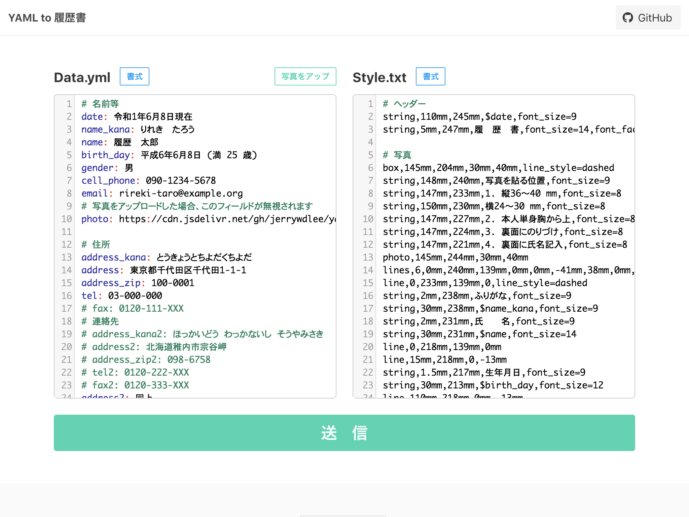

YAMLによる履歴書作成
===

[](LICENSE)

[kaityo256氏が開発した `yaml_cv`](https://github.com/kaityo256/yaml_cv)のマイクロサービス版です。  
YAML形式で書かれたデータファイルと、
YAMLもしくはテキストファイル形式で書かれた[スタイル](https://qiita.com/kaityo256/items/e3884d0109223c324baf)
から履歴書PDFファイルを作成します。

# Application
  
**https://yaml-2-resume.herokuapp.com/**

# インストール＆使用
## Docker

```sh
$ docker build -t my_yaml_2_resume .
$ docker run --rm -p 14567:4567 my_yaml_2_resume
$ open http://localhost:14567
```

## Docker Compose

```sh
$ docker-compose build
$ docker-compose up
$ open http://localhost:14567
```

## Dev Install(Loacl PC)
### 必要なライブラリ等
* Ruby >= v2.3
* bundler >= 2.0
* [ImageMagick](https://imagemagick.org/index.php)
* [IAPexフォント](https://ipafont.ipa.go.jp/node193#jp)

### MacOS

```sh
$ brew install imagemagick
$ gem install bundler
$ bundle install

# フォントをダウンロード、バージョンは適宜に替えていいです
$ curl https://oscdl.ipa.go.jp/IPAexfont/IPAexfont00401.zip > fonts.zip
$ unzip -oj fonts.zip -d fonts/ && rm -rf fonts.zip
$ ruby app.rb
$ open http://localhost:4567
```

また、ローカルでは[kaityo256/yaml_cv](https://github.com/kaityo256/yaml_cv)が提供したコマンドも実行できます。

```sh
$ ruby make_cv.rb -h
Usage: make_cv [options]
    -i, --input [datafile]
    -s, --style [stylefile]
    -o, --output [output]
```

```sh
ruby make_cv.rb -i templates/data.yaml -s templates/style.txt -o output.pdf
```

## HerokuでDeploy

```sh
$ heroku create YOUR-APP-NAME
$ heroku stack:set container
$ git push heroku master
```

# [kaityo256/yaml_cv](https://github.com/kaityo256/yaml_cv)との変更点

- `data.yaml`の`photo`フィールドは、URLも使えることになった。
- 提供された画像は向きを補正し、サイズも自動調節することになった。
- `data.yaml`と`style.txt`の中に、`erb`文法が書けるようになった。
- `data.yaml`に`@date`で現在の年月日を出していて、[和暦](https://github.com/sugi/wareki)も使えることになった。
- サンプルデータとスタイルは`templates/`配下に置いた。
- サンプルデータを当て障りのない文章に再構成した。
- サンプル写真を[StyleGAN](https://github.com/NVlabs/stylegan)で生成された偽の人物像を使った
